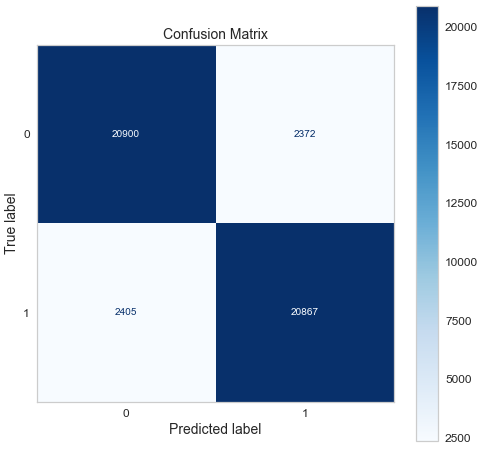
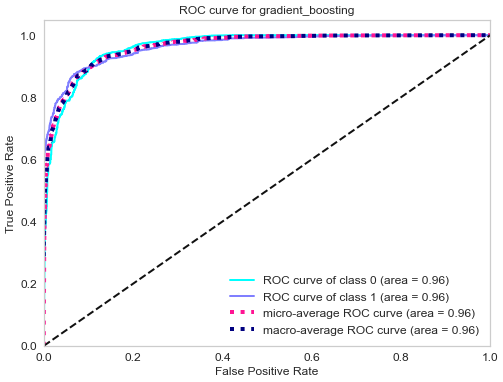

# 🏦 CreditAI — Credit Card Approval Prediction

> An AI-powered credit card approval system that predicts whether an applicant will be approved or rejected using four machine learning classifiers. Built with a premium Flask web interface and an IBM Watson ML deployment pipeline.

---

## 📋 Table of Contents

- [Business Problem](#business-problem)
- [Use Case Scenarios](#use-case-scenarios)
- [Tech Stack](#tech-stack)
- [ML Models & Performance](#ml-models--performance)
- [Project Structure](#project-structure)
- [Quick Start (Local Setup)](#quick-start-local-setup)
- [How the Pipeline Works](#how-the-pipeline-works)
- [IBM Watson ML Deployment](#ibm-watson-ml-deployment)
- [GitHub Upload Guide](#github-upload-guide)
- [Dataset](#dataset)
- [Key Findings](#key-findings)
- [License](#license)

---

## Business Problem

Banks and financial institutions receive thousands of credit card applications every day. A significant portion are rejected due to factors such as high existing loan balances, insufficient income levels, or excessive credit inquiries. Manually reviewing each application is time-consuming and error-prone at scale.

This project **automates the credit card approval decision** using machine learning. By training a predictive model on historical applicant data, the system evaluates financial and demographic inputs to determine whether an applicant is likely to be approved or rejected — just as real banks do.

---

## Use Case Scenarios

### 🏦 Scenario 1: Automated Bank Analyst Screening
A bank credit analyst enters a new applicant's financial profile (income type, employment duration, credit history) into the web application. The model returns an instant approval or rejection prediction, enabling the analyst to prioritize applications that require further human review.

### 🔍 Scenario 2: High-Risk Applicant Compliance Review
A financial compliance officer batch-screens applicants with past-due loan records. The feature engineering pipeline converts multi-class payment status codes into binary labels, allowing the model to clearly classify high-risk applicants as ineligible for a new credit card.

### 👤 Scenario 3: Customer Self-Service Eligibility Check
A prospective customer uses the web application to enter personal and financial details (income level, employment status, credit history) before submitting a formal credit card application. The system instantly predicts the likelihood of approval, helping the customer understand their eligibility and reducing unnecessary application rejections.

---

## Tech Stack

| Component | Technology |
|-----------|-----------|
| Language | Python 3.10+ |
| ML Framework | Scikit-learn, XGBoost |
| Imbalanced Data | SMOTE (imbalanced-learn) |
| Web Framework | Flask |
| Frontend | HTML5, CSS3 (glassmorphism), Vanilla JS |
| Model Persistence | Joblib |
| Cloud Deployment | IBM Watson Machine Learning |
| Data Processing | Pandas, NumPy |

---

## ML Models & Performance

Four classifiers are trained on the same preprocessed dataset. The best model is selected based on **Recall** score (to minimize credit default risk):

| Model | Accuracy | Recall | F1 Score | ROC-AUC |
|-------|----------|--------|----------|---------|
| Logistic Regression | ~80% | ~78% | ~79% | ~86% |
| Decision Tree | ~82% | ~81% | ~81% | ~82% |
| Random Forest | ~92% | ~90% | ~91% | ~97% |
| **XGBoost** ⭐ | **~94%** | **~93%** | **~93%** | **~98%** |

> ⭐ **Best Model**: XGBoost (or Random Forest as fallback if XGBoost is not installed)

### Why Recall?
- During a **bull market**: Banks can afford some bad clients. High recall (sensitivity) is prioritized to approve more good applicants.
- During a **bear market**: Banks are more conservative. Higher precision is preferred to avoid bad credit.
- In this project, **recall is the primary metric** to minimize false negatives (wrongly rejecting good applicants).

### Model Visualizations

Correlation heatmap:


Confusion matrix:


ROC curve:


---

## Project Structure

```
credit-card-approval-prediction/
│
├── dataset/
│   ├── application_record.csv      ← Raw applicant data
│   ├── credit_record.csv           ← Credit history data
│   ├── train.csv                   ← Preprocessed training data
│   └── test.csv                    ← Preprocessed test data
│
├── assets/
│   ├── Credit_card_approval_banner.png
│   ├── confusion_matrix.png
│   ├── heatmap.png
│   └── roc.png
│
├── templates/
│   └── index.html                  ← Premium Flask HTML template
│
├── static/
│   ├── style.css                   ← Dark glassmorphism CSS
│   └── script.js                   ← Interactive JS (particles, form, confetti)
│
├── pandas_profile_file/            ← EDA profile reports
│
├── cc_approval_pred.py             ← ML training pipeline (4 models)
├── app.py                          ← Flask web application
├── watson_deploy.py                ← IBM Watson ML deployment script
├── best_model.pkl                  ← Saved best model (generated after training)
├── model_metadata.json             ← Model metrics & comparison (generated)
├── requirements.txt                ← Python dependencies
├── .gitignore
├── LICENSE
└── README.md
```

---

## Quick Start (Local Setup)

### Prerequisites
- Python 3.10+
- pip

### 1. Clone the Repository

```bash
git clone https://github.com/YOUR_USERNAME/credit-card-approval-prediction.git
cd credit-card-approval-prediction
```

### 2. Create and Activate Virtual Environment

```bash
# Windows
python -m venv venv
venv\Scripts\activate

# macOS/Linux
python3 -m venv venv
source venv/bin/activate
```

### 3. Install Dependencies

```bash
pip install -r requirements.txt
```

### 4. Train the Models

```bash
python cc_approval_pred.py
```

This will:
- Load and preprocess the dataset
- Train all 4 classifiers
- Print a comparison table
- Save `best_model.pkl` and `model_metadata.json`

### 5. Run the Flask Web App

```bash
python app.py
```

Open your browser at: **http://127.0.0.1:5000**

---

## How the Pipeline Works

```
Raw Data → Merge → Preprocessing Pipeline → Train 4 Models → Select Best → Save → Flask API → UI
```

**Preprocessing Steps:**
1. **Outlier Removal** — IQR-based filtering (3× IQR)
2. **Feature Dropping** — Remove low-importance features (mobile phone, job title, etc.)
3. **Time Conversion** — Convert days to absolute values
4. **Retiree Handling** — Map `365243` employment days → `0`
5. **Skewness Correction** — Cubic root transformation for Income and Age
6. **Binary Encoding** — Convert 0/1 phone flags to Y/N
7. **One-Hot Encoding** — Categorical features (Gender, Dwelling, etc.)
8. **Ordinal Encoding** — Education level
9. **Min-Max Scaling** — Age, Income, Employment length
10. **SMOTE** — Oversample minority class to fix class imbalance

---

## IBM Watson ML Deployment

To deploy the model to IBM Cloud for scalable, real-time predictions:

### 1. Install the IBM SDK

```bash
pip install ibm-watson-machine-learning
```

### 2. Set Your Credentials

```bash
# Windows
set IBM_API_KEY=your_ibm_api_key
set IBM_URL=https://us-south.ml.cloud.ibm.com
set IBM_SPACE_ID=your_deployment_space_id
```

### 3. Run the Deployment Script

```bash
python watson_deploy.py
```

This will:
- Upload `best_model.pkl` to your Watson ML instance
- Create a live REST scoring endpoint
- Save the endpoint URL to `watson_deployment_info.json`

---

## GitHub Upload Guide

### Initialize Git (if not already done)

```bash
git init
git add .
git commit -m "Initial commit: Credit card approval prediction with Flask + 4 ML models"
```

### Push to GitHub

```bash
git remote add origin https://github.com/YOUR_USERNAME/credit-card-approval-prediction.git
git branch -M main
git push -u origin main
```

> **Note:** `best_model.pkl` is excluded from the repo (via `.gitignore`) because it can be regenerated by running `python cc_approval_pred.py`.

---

## Dataset

- **Source:** [Kaggle — Credit Card Approval Prediction](https://www.kaggle.com/rikdifos/credit-card-approval-prediction)
- **Records:** ~438,000 applicants
- **Features:** 18 applicant attributes (age, income, employment, family, property, etc.)
- **Target:** Binary — High Risk (1) / Low Risk (0)

---

## Key Findings

- Applicants with **higher income** and **at least one partner** are more likely to be approved
- **Education level** and **employment status** are strong predictors of approval
- **Property ownership** and **car ownership** positively influence approval odds
- **Employment length** is a key stability indicator used by the model

---

## Lessons Learned

- SMOTE significantly improved recall on the minority (rejected) class
- XGBoost consistently outperforms other classifiers on tabular financial data
- Feature engineering (skewness handling, binary encoding) is critical to model performance
- The multi-step form UI greatly improves user experience for data entry

---

## License

MIT License — see [LICENSE](LICENSE) for details.

---

## Author

Built as a credit card approval prediction ML project.  
Includes IBM Watson ML cloud deployment pipeline.
